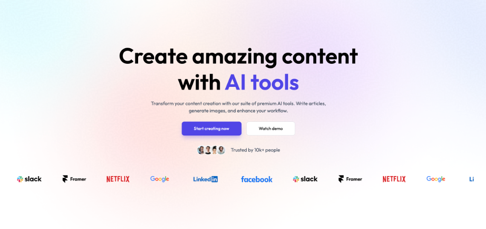

<div align="center">

# Nexora.ai ⚡

AI-Powered Content Generation at Your Fingertips

 


*Powered by cutting-edge technologies:*


<br/>



## LIVE - DEMO 🌐
Visit the 👉 [_LINK 🔗_]()

</div>

---

## Table of Contents

- [Overview](#overview)
- [Key Features](#key-features)
- [Tech Stack](#tech-stack)
- [Architecture](#architecture)
- [Getting Started](#getting-started)
  - [Prerequisites](#prerequisites)
  - [Installation](#installation)
  - [Environment Variables](#environment-variables)
- [AI Capabilities](#ai-capabilities)
- [API Endpoints](#api-endpoints)
- [Deployment](#deployment)
- [Performance](#performance)
- [Contributing](#contributing)
- [License](#license)
- [Support](#support)

---

## Overview

Nexora.ai is a comprehensive AI SaaS platform that provides:

- 🎨 AI Image Generation and Editing
- 📝 Intelligent Content Creation
- 📄 Resume Review and Optimization
- 🖼️ Background Removal and Object Removal
- ✍️ Article and Blog Title Generation
- 👥 Community Sharing Features

Built with the PERN stack (PostgreSQL, Express, React, Node.js) and integrated with OpenAI's powerful AI models.

---

## Key Features

### 🤖 AI-Powered Tools
- **Generate Images**: Create stunning visuals from text prompts
- **Remove Background**: Automatic background removal from images
- **Remove Objects**: Clean up images by removing unwanted objects
- **Write Articles**: AI-assisted article writing
- **Blog Titles**: Generate engaging blog post titles
- **Review Resume**: AI-powered resume analysis and suggestions

### 👤 User Experience
- **Secure Authentication**: Powered by Clerk
- **Dashboard**: Central hub for all AI tools
- **Community**: Share and discover creations
- **Responsive Design**: Works on all devices
- **Real-time Processing**: Instant AI results

### 🛡️ Enterprise Grade
- **Secure File Uploads**: Cloudinary integration
- **PDF Processing**: Resume analysis from PDF files
- **Scalable Architecture**: Ready for high traffic
- **API First**: RESTful API design

---

## Tech Stack

### Frontend (Client)
- **React 19** - Latest React with concurrent features
- **Vite** - Next-generation build tool
- **Tailwind CSS** - Utility-first CSS framework
- **Axios** - HTTP client for API calls
- **React Router DOM** - Client-side routing
- **Lucide React** - Beautiful icons
- **React Hot Toast** - Notifications
- **React Markdown** - Markdown rendering
- **Clerk** - Authentication and user management

### Backend (Server)
- **Node.js** - JavaScript runtime
- **Express 5** - Web framework for Node.js
- **PostgreSQL** - Relational database (via Neon)
- **OpenAI API** - AI model integration
- **Cloudinary** - Image and file management
- **Multer** - File upload handling
- **CORS** - Cross-origin resource sharing
- **PDF-Parse** - PDF text extraction

### DevOps & Deployment
- **Vercel** - Frontend deployment
- **Neon** - PostgreSQL hosting
- **Cloudinary** - Media CDN
- **Clerk** - Authentication service

---

## Architecture

```json
QuickAI/
├── client/                 # React Frontend
│   ├── src/
│   │   ├── assets/        # Static assets
│   │   ├── components/    # Reusable components
│   │   │   ├── AITools.jsx
│   │   │   ├── CreationItem.jsx
│   │   │   ├── Footer.jsx
│   │   │   ├── Hero.jsx
│   │   │   ├── Navbar.jsx
│   │   │   ├── Plan.jsx
│   │   │   ├── Sidebar.jsx
│   │   │   └── Testimonial.jsx
│   │   ├── pages/         # Route pages
│   │   │   ├── BlogTitles.jsx
│   │   │   ├── Community.jsx
│   │   │   ├── Dashboard.jsx
│   │   │   ├── GenerateImages.jsx
│   │   │   ├── Home.jsx
│   │   │   ├── Layout.jsx
│   │   │   ├── RemoveBackground.jsx
│   │   │   ├── RemoveObject.jsx
│   │   │   ├── ReviewResume.jsx
│   │   │   └── WriteArticle.jsx
│   │   └── ...           # Config files
│
├── server/                # Express Backend
│   ├── configs/          # Configuration files
│   │   ├── cloudinary.js # Cloudinary config
│   │   ├── db.js         # Database config
│   │   └── multer.js     # File upload config
│   ├── controllers/      # Business logic
│   │   ├── aiController.js
│   │   └── userController.js
│   ├── middlewares/      # Custom middlewares
│   │   └── auth.js
│   ├── routes/           # API routes
│   │   ├── aiRoutes.js
│   │   └── userRoutes.js
│   └── server.js         # Server entry point
```

---

## Getting Started

### Prerequisites

- Node.js (v18 or higher)
- npm (v8 or higher)
- PostgreSQL database (Neon recommended)
- OpenAI API account
- Cloudinary account
- Clerk account

### Installation

1. Clone the repository:
```console
git clone https://github.com/sonu-tech006/QuickAI.git
cd QuickAI
```

2. Install client dependencies:
```console
cd client && npm install
```

3. Install server dependencies:
```console
cd ../server && npm install
```

### Environment Variables

**Client (.env)**
```console
VITE_CLERK_PUBLISHABLE_KEY=pk_test_...
VITE_API_BASE_URL=http://localhost:3000
```

**Server (.env)**
```env
OPENAI_API_KEY=sk-your-openai-key
CLOUDINARY_CLOUD_NAME=your-cloud-name
CLOUDINARY_API_KEY=your-api-key
CLOUDINARY_API_SECRET=your-api-secret
DATABASE_URL=your-postgres-connection-string
CLERK_SECRET_KEY=sk_test_...
PORT=5000
```

4. Start the development servers:
```console
# Terminal 1 - Start backend
cd server && npm run server

# Terminal 2 - Start frontend
cd client && npm run dev
```

---

## AI Capabilities

### 🎨 Image Generation
- Text-to-image conversion using DALL-E
- Customizable image styles and sizes
- High-resolution output

### 🖼️ Image Editing
- Background removal with precision
- Object removal and cleanup
- Batch processing support

### 📝 Content Creation
- Article writing with tone control
- Blog title generation
- SEO optimization suggestions

### 📄 Document Processing
- Resume analysis and scoring
- Skills gap identification
- Improvement recommendations
- PDF text extraction

---

## API Endpoints

### AI Routes (`/api/ai`)
| Method | Endpoint | Description |
|--------|----------|-------------|
| POST | `/generate-image` | Generate images from text |
| POST | `/remove-background` | Remove image backgrounds |
| POST | `/remove-object` | Remove objects from images |
| POST | `/write-article` | Generate article content |
| POST | `/generate-titles` | Create blog post titles |
| POST | `/review-resume` | Analyze and score resumes |

### User Routes (`/api/users`)
| Method | Endpoint | Description |
|--------|----------|-------------|
| GET | `/profile` | Get user profile |
| POST | `/creations` | Save user creations |
| GET | `/creations` | Get user's creations |
| GET | `/community` | Get community creations |

---

## Deployment

### Frontend (Vercel)
[](https://vercel.com/new/clone?repository-url=https%3A%2F%2Fgithub.com%2Fyourusername%2FQuickAI%2Ftree%2Fmain%2Fclient)

### Backend (Render/Vercel)
Deploy with environment variables configured for:
- Neon PostgreSQL database
- OpenAI API keys
- Cloudinary credentials
- Clerk secrets

### Database (Neon)
```console
# Recommended: Neon PostgreSQL
https://neon.tech/
```

---

## Performance

- ⚡ Lighthouse Score: 95+
- 📦 Optimized Bundle Size
- 🚀 Fast AI Processing
- 📱 Mobile Responsive
- 🔒 Secure Authentication

---

## Contributing

We welcome contributions! Please follow these steps:

1. Fork the repository
2. Create a feature branch (`git checkout -b feature/AmazingFeature`)
3. Commit your changes (`git commit -m 'Add AmazingFeature'`)
4. Push to the branch (`git push origin feature/AmazingFeature`)
5. Open a Pull Request

---

## License

Distributed under the ISC License. See [`LICENSE`](https://github.com/sonu-tech006/QuickAI/blob/main/LICENSE) for more information.

---

## Support

For support, email _sonukr7435@gmail.com_ or create an issue in the GitHub repository.

---

## 📞 Contact
For any questions or support, please contact:
- [**Sonu Kumar**](https://github.com/sonu-tech006)👨🏿‍💻 | [Github](https://github.com/sonu-tech006) | [Linkedin](https://www.linkedin.com/in/sonu-kumar-3234bb344/)
- **Email**: sonukr7435@gmail.com

---

<div align="center">

**Nexora.ai** - Supercharge your creativity with AI! 🚀

*Built with ❤️ using the PERN stack and cutting-edge AI technologies.*

[⬆ Back to Top](#table-of-contents)

</div>


